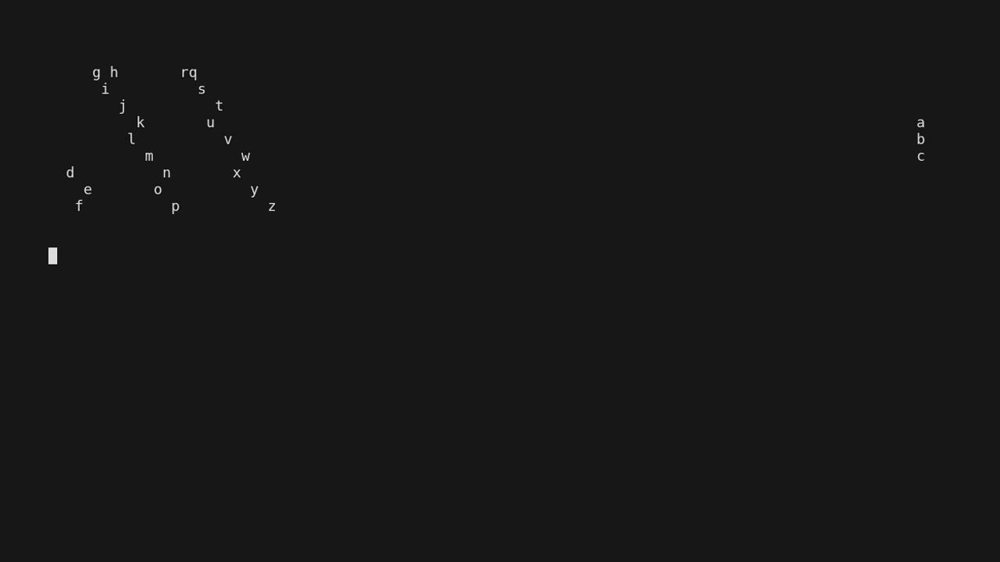

# ECS Lens


A terminal ECS (entity component system) simulation using lenses in Haskell.

## Usage

Run with:

```
nix run
```

## Development

This project uses Nix flakes. Enter the dev shell with:

```
direnv allow
```

Then build or run with cabal:

```
cabal build
cabal run
```
